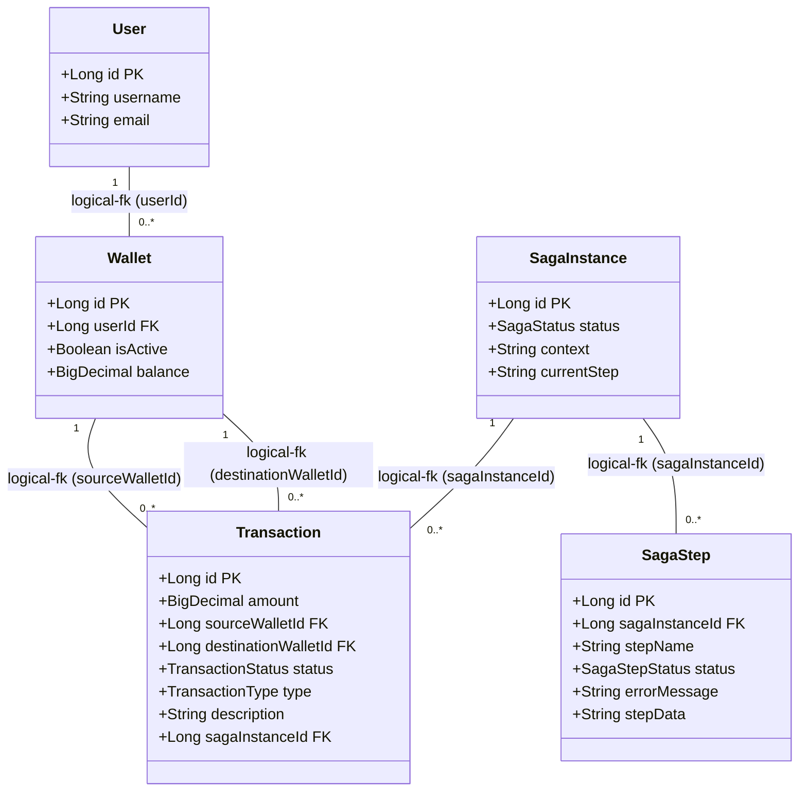
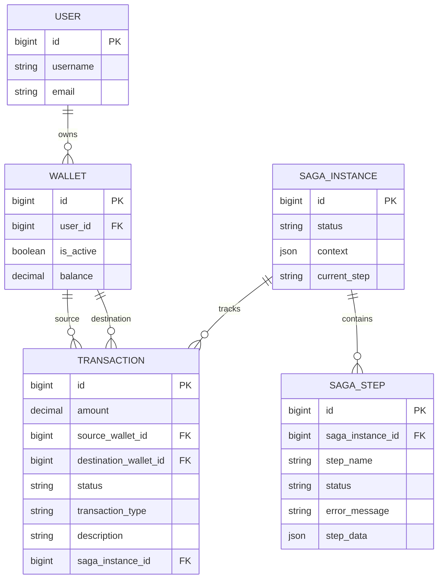

# Distributed Sharded Wallet System - High-Availability Saga Orchestration Engine

A production-grade, eventually consistent financial ledger engineered to coordinate atomic balance mutations across sharded database infrastructures without synchronous network locking.

---

## 🏗 Distributed Transaction Architecture

```text
   ┌────────────┐
   │ Client App │
   └─────┬──────┘
         │ HTTP POST /api/transactions/transfer
         ▼
┌──────────────────────┐
│ TransferSagaService  │ (Main coordination block)
└────────┬─────────────┘
         │ Starts parent SagaInstance
         ▼
┌──────────────────────┐
│   SagaOrchestrator   │ (Manages states, executes steps & catches exceptions)
└────────┬─────────────┘
         │
         ├─────────────────────────────────────────┐
         │ (Isolated Transaction Boundary)         │ (Isolated Transaction Boundary)
         ▼                                         ▼
┌─────────────────────────┐               ┌────────────────────────────┐
│  DebitSourceWalletStep  │               │ CreditDestinationWalletStep│
└────────┬────────────────┘               └────────┬───────────────────┘
         │                                         │
         ▼ (Shard 1 / SQL lock)                    ▼ (Shard 2 / SQL lock)
┌─────────────────────────┐               ┌────────────────────────────┐
│      shardwallet1       │               │        shardwallet2        │
│ (wallets, transactions) │               │  (wallets, transactions)   │
└─────────────────────────┘               └────────────────────────────┘

```

### Saga Orchestration vs. Two-Phase Commit (2PC)

Traditional distributed transaction systems rely on **Two-Phase Commit (2PC)** to guarantee consistency across different database nodes. Under 2PC, the system works in two distinct stages:

1. **Prepare Phase:** A central coordinator queries all participating database nodes to ensure they can write the transaction data. Each node locks the necessary rows and returns a vote.
2. **Commit Phase:** If all nodes vote positively, the coordinator commands everyone to commit the transaction, releasing the database locks.

While 2PC provides immediate consistency, it introduces severe architectural trade-offs:

* **Blocking Coordinator Crash:** If the central coordinator fails after lock acquisition but before issuing the commit decision, all databases remain locked indefinitely.
* **Long-Lived Row Locks:** Database locks are held across network round-trips (from lock acquisition until the final commit message arrives). In high-throughput ledger systems, holding locks over network hops drastically lowers performance and leads to frequent deadlocks.
* **CAP Theorem Constraints:** Under the CAP theorem, 2PC prioritizes Consistency (C) over Availability (A). In a sharded environment, transient network partition events render the entire system unavailable.

Our **Saga Orchestrator** replaces synchronous blocking with **Eventual Consistency**. Instead of acquiring distributed locks across the network, each step commits its local changes immediately to its target database shard. If a step fails, the orchestrator triggers compensation transactions backward to reverse the modifications, ensuring the ledger eventually balances.

### Transactional Shield Architecture

To prevent a single step failure from halting or poisoning the entire transaction tree, the system implements a **Transactional Shield Architecture**:

* The orchestrator forces individual execution steps to run inside completely **isolated transaction boundaries**.
* When a step executes, it suspends the master transaction and starts its own independent connection session on its specific database shard (e.g., `shardwallet1`).
* If a database timeout or lock conflict occurs inside that step, only the isolated step transaction rolls back.
* The parent transaction inside the `SagaOrchestrator` is shielded from this failure and remains active. This allows the system to reliably log the failure status in the audit tables and execute compensation flows cleanly without encountering unexpected rollback exceptions.

---

## Technical Feature Set

* **Orchestrator-Driven Sagas:** Tracks distributed workflows dynamically using a state engine. State information is persisted in dedicated status tables, creating a durable audit trail of every distributed financial mutation.
* **Blast Containment:** Isolates the database operations of individual ledger steps. This decouples local shard lock contentions from the orchestrator's state database updates.
* **In-Memory Exponential Backoff Engine:** Automatically retries transient database lock failures (such as pessimistic locking failures or lock acquisition timeouts). The self-healing retry pipeline uses the following parameters:
    * **Maximum Attempts:** 3
    * **Initial Interval:** 100 ms
    * **Backoff Multiplier:** 2.0


* **Symmetrical Compensation & System Alarms:** When transient failures are exhausted or business rules are violated, the orchestrator executes reverse-flow compensation logic. 

---

## 🗂 Data Model

The domain model below illustrates the core entities of the ledger. Since data is physically sharded across independent database instances, cross-shard relationships (e.g., `Wallet` → `Transaction`) are enforced logically at the application layer rather than through physical foreign key constraints.



### Entity-Relationship Diagram



---

## Infrastructure Setup & Local Execution

### 1. Database Sharding Setup

This ledger utilizes **Apache ShardingSphere** to distribute transaction logs across multiple databases. The sharding configuration is located in `sharding.yaml` and application variables are managed in `application.yaml`.

**Physical Shard Layout**

Every sharded table (`users`, `wallets`, `transactions`, `saga_instance`, `saga_step`) is physically replicated across both shard databases, and each row is routed to exactly one of them based on the sharding algorithm:

```text
MySQL Instance
├── shardwallet1
│   ├── users
│   ├── wallets
│   ├── transactions
│   ├── saga_instance
│   └── saga_step
│
└── shardwallet2
    ├── users
    ├── wallets
    ├── transactions
    ├── saga_instance
    └── saga_step
```

**Sharding Strategy**

Routing is `id`-based using ShardingSphere's `INLINE` algorithm (`shardwallet${id % 2 + 1}`), with primary keys generated via the `SNOWFLAKE` key generator to guarantee global uniqueness across shards. The relevant excerpt from `sharding.yaml`:

**Local Setup Steps**

1. Create two local MySQL database instances named `shardwallet1` and `shardwallet2`.
2. Define your environment passwords for the database connections or update the connection pool settings directly in `sharding.yaml`.

### 2. Compilation & Verification

To verify the transaction routing configurations and check if the code compiles successfully, run:

```bash
./gradlew compileJava

```

### 3. Running the Server Locally

To start the Spring Boot application locally on port `8080`:

```bash
./gradlew bootRun

```